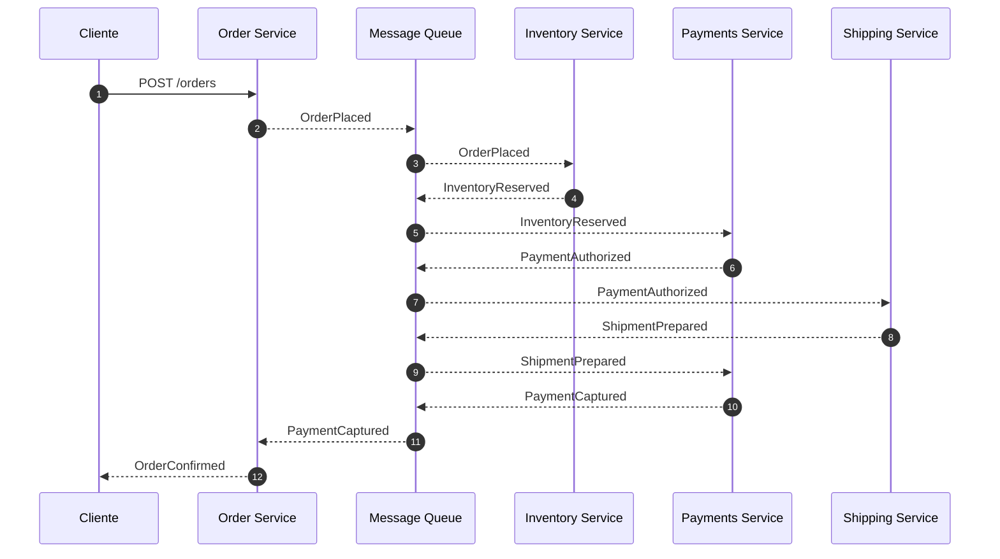

# Reatiler Workflow Monorepo

Este monorepo establece la semántica base para un ecosistema de microservicios orientado a órdenes dentro de un retailer. Siguiendo la filosofía **Spec-as-Source**, toda la documentación de contexto y decisiones arquitectónicas viven junto al código para garantizar trazabilidad y consistencia.

## Mapa del repositorio

```
.
├── adr/               # Architecture Decision Records
├── docs/              # Escenarios, agentes y políticas globales
├── business/          # Escenarios declarativos por dominio
├── packages/
│   └── shared/        # Código compartido entre servicios
├── services/
│   ├── message-queue/
│   └── scenario-runner/
├── package.json
├── pnpm-workspace.yaml
├── turbo.json
└── tsconfig.base.json
```

## Instalación

```bash
pnpm install
```

## Configuración rápida

La configuración mediante un archivo `.env` es opcional. Por defecto, los servicios intentarán conectarse a la cola de mensajes en `http://localhost:3005`. Si necesitas personalizarla, copia [`./.env.example`](./.env.example) como `.env` en la raíz y ajusta las variables disponibles.

## Arranque local

Ahora la lógica de los dominios se describe declarativamente en los ficheros JSON bajo [`/business/`](./business). El flujo completo se ejecuta con `message-queue` + `scenario-runner`, mientras que el visualizador se adapta automáticamente al escenario activo.

```bash
pnpm i
pnpm dev
```

El comando anterior orquesta ambos servicios mediante Turborepo. También puedes ejecutarlos por separado en terminales distintas:

```bash
pnpm -F message-queue dev
pnpm -F scenario-runner dev
```

## Levantar stack de demo con escenarios

### Opción 1: manual

En tres terminales independientes:

```bash
pnpm -F message-queue dev
pnpm -F scenario-runner dev
pnpm -F @reatiler/visualizer-cli dev
```

Al arrancar, el visualizador pedirá elegir un escenario (según `business/*.json`).

Cambiar de escenario desde el visualizador:

- Llama a `POST /admin/reset` en `message-queue` para limpiar todas las colas.
- Cambia el escenario activo con `POST /scenario` en `scenario-runner`.
- Se redibuja automáticamente con las nuevas columnas/dominios.

### Opción 2: stack:dev

Si ya tienes configurado el script `stack:dev`:

```bash
pnpm stack:dev retailer-happy-path
# y luego sigue las instrucciones del visualizer para elegir o cambiar de escenario
```

### Logging

El nivel de logs de los servicios puede ajustarse mediante la variable de entorno `LOG_LEVEL`. Por defecto se utiliza `warn` para evitar ruido al hacer polling en la cola, pero es posible elevarlo cuando se necesite más visibilidad:

```bash
LOG_LEVEL=info pnpm dev
```

## Puesta en marcha

El runner interpreta los escenarios declarativos y publica eventos en la cola HTTP. No es necesario implementar lógica específica por dominio: basta con editar los JSON bajo `business/` y volver a arrancar los servicios para reflejar nuevos comportamientos.

## Visualizador de escenarios

El CLI de visualización consume únicamente la definición de escenario publicada en `business/*.json` y los eventos espejados por la cola `visualizer`. Cualquier cambio en el JSON se refleja automáticamente en columnas, estados y flujos.

```bash
pnpm install
pnpm dev                               # levanta cola y servicios
pnpm -F @reatiler/visualizer-cli dev   # abre el visualizador en modo watch

curl -s -X POST http://localhost:3001/orders \
  -H 'content-type: application/json' \
  -d '{"requestId":"req-1","lines":[{"sku":"SKU-1","qty":1}],"amount":100}'
```

De forma predeterminada se carga el escenario `business/retailer-happy-path.json`, aunque puede seleccionarse otro mediante la variable `SCENARIO_NAME`. El visualizador construye dinámicamente columnas, estados y flujos a partir del contenido del escenario.

## Filosofía Spec-as-Source

Las especificaciones son la fuente de verdad para implementación, pruebas y operación. Las ADR, políticas y escenarios documentados en este repositorio definen los contratos que los equipos deben respetar. Los agentes automatizados (Generator, Linter y Evaluator) se apoyarán en estas especificaciones para asegurar consistencia y gobernanza.

## Especificaciones

El directorio [`/specs`](./specs/README.md) concentra los contratos OpenAPI, AsyncAPI y JSON Schema. Todo el código de los servicios deberá derivarse exclusivamente de estos archivos, sin endpoints ni mensajes adicionales a los definidos allí.

## SAGA principal




## Pruebas

### Unitarias

Los tests rápidos siguen respaldando los contratos compartidos y la infraestructura.

```bash
pnpm test:unit
pnpm -F message-queue test:unit
pnpm -F scenario-runner test
pnpm -F @reatiler/shared test:unit
pnpm -F @reatiler/saga-kernel test
```

### End-to-end y flujos orquestados

Los recorridos de la SAGA ahora se describen en `business/*.json` y se ejecutan mediante el runner.

```bash
pnpm test:e2e
```

Para inspeccionar los eventos publicados en la cola sin consumirlos, ejecuta el visualizador. Detectará las colas relevantes según el escenario cargado.

```bash
pnpm -F visualizer-cli dev
```

### Exploración manual

Modifica el escenario activo dentro de `business/` (por ejemplo, cambiando tiempos o respuestas) y reinicia `scenario-runner` para observar el nuevo comportamiento. No es necesario habilitar toggles por servicio: la cola y el runner absorben los cambios declarativos.

```bash
# en una terminal
pnpm -F message-queue dev

# en otra
pnpm -F scenario-runner dev
```

El visualizador CLI se ajustará automáticamente a las colas publicadas por el escenario.

## Migración

Los servicios de dominio anteriores (orders, inventory, etc.) se han eliminado; su comportamiento se encuentra descrito en los escenarios de negocio.
