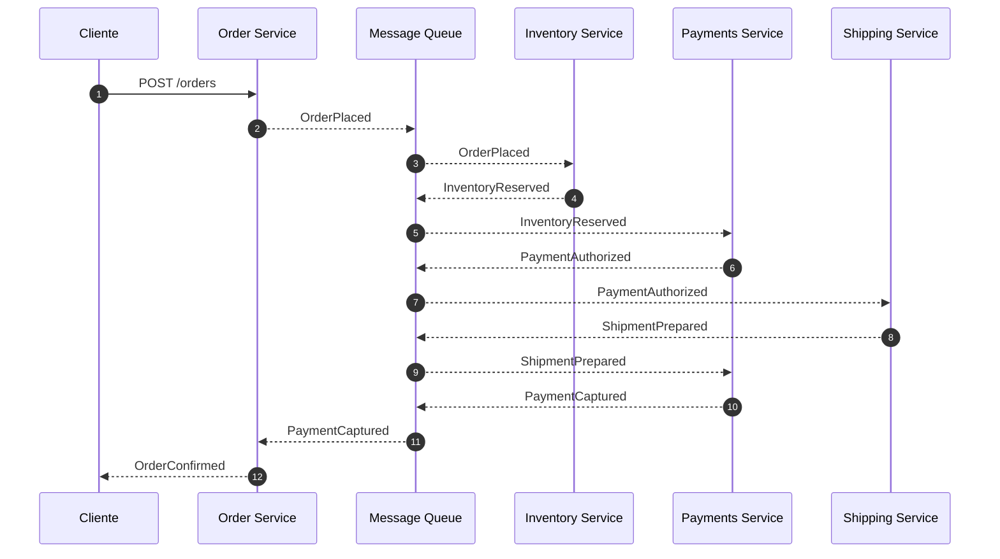

# Reatiler Workflow Monorepo

Este monorepo establece la semántica base para un ecosistema de microservicios orientado a órdenes dentro de un retailer. Siguiendo la filosofía **Spec-as-Source**, toda la documentación de contexto y decisiones arquitectónicas viven junto al código para garantizar trazabilidad y consistencia.

## Mapa del repositorio

```
.
├── adr/               # Architecture Decision Records
├── docs/              # Escenarios, agentes y políticas globales
├── packages/
│   └── shared/        # Código compartido entre servicios
├── services/
│   ├── inventory/
│   ├── message-queue/
│   ├── order/
│   ├── payments/
│   └── shipping/
├── package.json
├── pnpm-workspace.yaml
├── turbo.json
└── tsconfig.base.json
```

## Instalación

```bash
pnpm install
```

## Configuración rápida

La configuración mediante un archivo `.env` es opcional. Por defecto, los servicios intentarán conectarse a la cola de mensajes en `http://localhost:3005`. Si necesitas personalizarla, copia [`./.env.example`](./.env.example) como `.env` en la raíz y ajusta las variables disponibles.

## Arranque local

El entorno local levanta cinco procesos (cola de mensajes más cuatro dominios) mediante Turborepo.

```bash
pnpm i
pnpm dev
curl :3001/health
curl :3005/health
```

Cada servicio expone `/health` devolviendo `{"status":"ok","service":"<nombre>"}` y escucha en los puertos 3001 al 3005.

### Logging

El nivel de logs de los servicios puede ajustarse mediante la variable de entorno `LOG_LEVEL`. Por defecto se utiliza `warn` para evitar ruido al hacer polling en la cola, pero es posible elevarlo cuando se necesite más visibilidad:

```bash
LOG_LEVEL=info pnpm dev
```

## Puesta en marcha

Cada servicio contará con scripts de desarrollo orquestados mediante Turborepo. Por ahora, los comandos son placeholders hasta que se implemente la lógica de cada dominio.

```bash
pnpm dev
```

## Visualizador de escenarios

El CLI de visualización consume únicamente la definición de escenario publicada en `business/*.json` y los eventos espejados por la cola `visualizer`. Cualquier cambio en el JSON se refleja automáticamente en columnas, estados y flujos.

```bash
pnpm install
pnpm dev                               # levanta cola y servicios
pnpm -F @reatiler/visualizer-cli dev   # abre el visualizador en modo watch

curl -s -X POST http://localhost:3001/orders \
  -H 'content-type: application/json' \
  -d '{"requestId":"req-1","lines":[{"sku":"SKU-1","qty":1}],"amount":100}'
```

De forma predeterminada se carga el escenario `business/retailer-happy-path.json`, aunque puede seleccionarse otro mediante la variable `SCENARIO_NAME`. El visualizador construye dinámicamente columnas, estados y flujos a partir del contenido del escenario.

## Filosofía Spec-as-Source

Las especificaciones son la fuente de verdad para implementación, pruebas y operación. Las ADR, políticas y escenarios documentados en este repositorio definen los contratos que los equipos deben respetar. Los agentes automatizados (Generator, Linter y Evaluator) se apoyarán en estas especificaciones para asegurar consistencia y gobernanza.

## Especificaciones

El directorio [`/specs`](./specs/README.md) concentra los contratos OpenAPI, AsyncAPI y JSON Schema. Todo el código de los servicios deberá derivarse exclusivamente de estos archivos, sin endpoints ni mensajes adicionales a los definidos allí.

## SAGA principal




## Pruebas

### Unitarias

Ejecutan los tests rápidos (incluyendo contratos compartidos y workers) sin habilitar los E2E.

```bash
pnpm test:unit
pnpm -F order test:unit
pnpm -F inventory test:unit
pnpm -F payments test:unit
pnpm -F shipping test:unit
pnpm -F message-queue test:unit
pnpm -F @reatiler/shared test:unit
```

### End-to-end (happy path + smokes de compensación)

Los recorridos de la SAGA se ejecutan en memoria usando `FakeEventBus`. Incluyen el happy path y los tres smokes de fallo.

```bash
pnpm test:e2e           # orquesta todos los E2E disponibles
pnpm -F order test:e2e  # ejecuta únicamente los recorridos end-to-end
```

### Smokes manuales

Los mismos escenarios de compensación pueden explorarse a mano levantando los servicios y jugando con los toggles.

```bash
pnpm dev

# A) Fallo en reserva de inventario
ALLOW_RESERVATION=false pnpm -F inventory dev &
curl -s -X POST http://localhost:3001/orders \
  -H 'content-type: application/json' \
  -d '{"requestId":"r2","lines":[{"sku":"SKU1","qty":1}],"amount":100,"address":{"line1":"Calle 1","city":"Madrid","zip":"28001","country":"ES"}}' | jq
# GET /orders/{id} -> status: FAILED

# B) Fallo en autorización de pago → stock liberado, pedido cancelado
ALLOW_AUTH=false pnpm -F payments dev &
# POST /orders ... -> luego GET /orders/{id} -> status: CANCELLED

# C) Fallo tardío en shipping → refund y cancelación
ALLOW_PREPARE=false pnpm -F shipping dev &
# POST /orders ... -> luego GET /orders/{id} -> status: CANCELLED

# Para validar la cola manualmente
pnpm -F message-queue dev
curl http://localhost:3005/health
curl -X POST http://localhost:3005/queues/test/messages -H 'content-type: application/json' -d '{"eventName":"Ping","version":1,"eventId":"e1","traceId":"t1","correlationId":"c1","occurredAt":"2025-01-01T00:00:00Z","data":{}}'
curl -X POST http://localhost:3005/queues/test/pop
```
