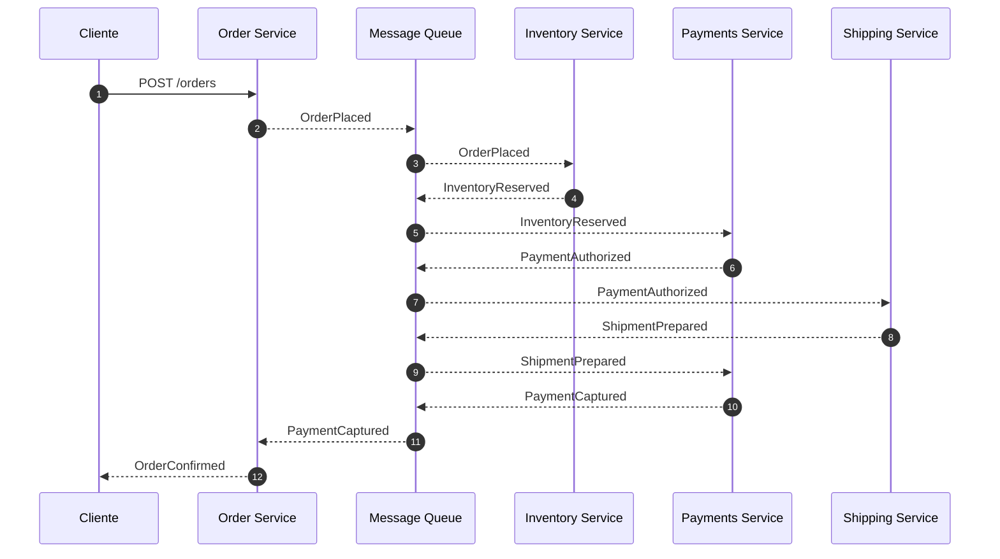

# Reatiler Workflow Monorepo

Este monorepo establece la semántica base para un ecosistema de microservicios orientado a órdenes dentro de un retailer. Siguiendo la filosofía **Spec-as-Source**, toda la documentación de contexto y decisiones arquitectónicas viven junto al código para garantizar trazabilidad y consistencia.

## Mapa del repositorio

```
.
├── adr/               # Architecture Decision Records
├── docs/              # Escenarios, agentes y políticas globales
├── packages/
│   └── shared/        # Código compartido entre servicios
├── services/
│   ├── inventory/
│   ├── message-queue/
│   ├── order/
│   ├── payments/
│   └── shipping/
├── package.json
├── pnpm-workspace.yaml
├── turbo.json
└── tsconfig.base.json
```

## Instalación

```bash
pnpm install
```

## Arranque local

El entorno local levanta cinco procesos (cola de mensajes más cuatro dominios) mediante Turborepo.

```bash
pnpm i
pnpm dev
curl :3001/health
curl :3005/health
```

Cada servicio expone `/health` devolviendo `{"status":"ok","service":"<nombre>"}` y escucha en los puertos 3001 al 3005.

## Puesta en marcha

Cada servicio contará con scripts de desarrollo orquestados mediante Turborepo. Por ahora, los comandos son placeholders hasta que se implemente la lógica de cada dominio.

```bash
pnpm dev
```

## Filosofía Spec-as-Source

Las especificaciones son la fuente de verdad para implementación, pruebas y operación. Las ADR, políticas y escenarios documentados en este repositorio definen los contratos que los equipos deben respetar. Los agentes automatizados (Generator, Linter y Evaluator) se apoyarán en estas especificaciones para asegurar consistencia y gobernanza.

## SAGA principal


