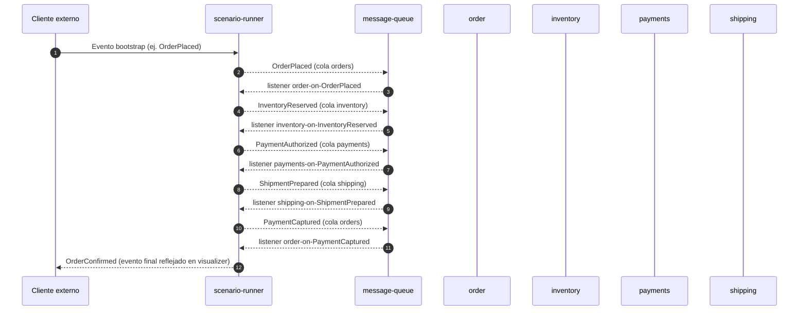

# Orquestación principal del Reatiler Workflow

El monorepo modela una SAGA retail completamente declarativa. Los escenarios bajo `business/` describen dominios, eventos y listeners que el runtime ejecuta sin lógica adicional. Esta sección resume el comportamiento de referencia y cómo interactúan los servicios para ofrecer simulaciones de extremo a extremo.【F:business/retailer-happy-path.json†L1-L132】【F:services/scenario-runner/src/index.ts†L400-L520】

## Dominios y colas estándar

El escenario `retailer-happy-path.json` define cuatro dominios conectados a las siguientes colas de `message-queue`:

| Dominio | Cola | Descripción |
| --- | --- | --- |
| `order` | `orders` | Origen y cierre de la orden retail. |
| `inventory` | `inventory` | Reserva y liberación de stock. |
| `payments` | `payments` | Autorización y captura de cobros. |
| `shipping` | `shipping` | Preparación y despacho de envíos. |

Puedes añadir dominios adicionales según el flujo que quieras simular, siempre respetando el esquema del DSL.【F:packages/saga-kernel/src/schema.ts†L1-L128】

## Contrato de eventos (`payloadSchema`)

Cada evento incluye `payloadSchema`, que funciona como contrato de datos entre dominios. Admite tipos primitivos (`string`, `number`, `boolean`), arrays de primitivos (`string[]`, `number[]`, `boolean[]`), objetos planos de un solo nivel y arrays de objetos planos. No se permiten anidaciones adicionales ni arrays de arrays. Si un evento no requiere datos, se define `payloadSchema: {}`.【F:business/retailer-happy-path.json†L10-L92】【F:packages/saga-kernel/src/schema.ts†L1-L128】

En el escenario base, `OrderPlaced` describe identificadores, monto, dirección y líneas del pedido mediante `payloadSchema`, mientras que `OrderConfirmed` solo necesita el identificador y el estado final.【F:business/retailer-happy-path.json†L12-L91】

## Mapping de payloads en acciones `emit`

Cada acción `emit` debe declarar un bloque `mapping` que describe cómo construir el payload del evento de destino a partir del evento que activó el listener. El runtime valida y aplica estos mapeos en tiempo de ejecución para arrastrar los datos a lo largo de toda la SAGA.【F:packages/saga-kernel/src/schema.ts†L1-L420】【F:packages/saga-kernel/src/runtime.ts†L1-L220】

Reglas principales:

- **Escalares** (`string`, `number`, `boolean`): usa alias directo (`"campoDestino": "campoOrigen"`), `{ "from": "campo" }` o constantes `{ "const": valor }`.
- **Objetos planos**: declara `{ "map": { ... } }` y, si el origen está anidado, añade `objectFrom` para indicar el objeto origen.
- **Arrays de objetos planos**: usa `{ "arrayFrom": "campoArray", "map": { ... } }` para transformar cada elemento.
- **Arrays de primitivos** (`string[]`, `number[]`, `boolean[]`): mapea directamente con `from` o alias. No se permiten constantes en este caso.【F:packages/saga-kernel/src/schema.ts†L56-L260】【F:packages/saga-kernel/src/mapping.ts†L1-L220】
- Los mapeos pueden mezclar valores propagados y constantes, pero no admiten lógica condicional ni transformaciones complejas.

Ejemplo simplificado:

```jsonc
{
  "type": "emit",
  "event": "ShipmentPrepared",
  "toDomain": "shipping",
  "mapping": {
    "shipmentId": { "const": "SHIP-001" },
    "orderId": "orderId",
    "amount": "amount",
    "address": {
      "objectFrom": "address",
      "map": {
        "line1": "line1",
        "city": "city"
      }
    }
  }
}
```

Si un mapeo apunta a un campo inexistente o falta la definición de un atributo obligatorio, la validación del DSL lo marca como error para evitar inconsistencias durante la simulación.【F:packages/saga-kernel/src/schema.ts†L200-L420】

## Flujo SAGA (happy path)



Cada listener puede declarar un `delayMs` para simular tiempos de procesamiento y emite eventos hacia otros dominios utilizando acciones `emit`. Las acciones `set-state` actualizan el estado visible por `visualizer-api`, el CLI y la interfaz web.【F:business/retailer-happy-path.json†L94-L160】

## Escenarios alternativos y compensaciones

El DSL permite definir caminos de compensación usando eventos adicionales y acciones `set-state` con estados que incluyan `fail`, `cancel`, `refund`, etc. Estos estados son interpretados por el CLI y la web para colorear los eventos y resaltar fallos o compensaciones.【F:packages/visualizer-cli/src/index.ts†L85-L120】

Para disparar flujos alternativos puedes:

1. Editar el JSON en `business/` y reiniciar `scenario-runner` (o usar `/scenario` en `scenario-runner` para recargarlo).
2. Generar un borrador en `scenario-designer`, refinarlo con feedback y aplicar el draft desde `visualizer-api` o `visualizer-web` cuando esté marcado como `ready`. Esto permite iterar rápidamente sin tocar el repositorio hasta tener una versión final.【F:services/scenario-designer/src/index.ts†L440-L840】【F:services/visualizer-api/src/index.ts†L544-L720】

## Visualización y estado compartido

- `scenario-runner` replica cada evento consumido hacia la cola `visualizer`, que contiene una versión reducida con `traceId`, dominio y timestamp.
- `visualizer-api` procesa esa cola, normaliza los eventos, los guarda por `traceId` en `state-store` y expone el estado mediante `/traces`, `/logs`, `/scenario`, `/scenario-bootstrap` y `/scenarios`.
- `visualizer-web` y `@reatiler/visualizer-cli` consultan esas APIs y representan la historia completa de la SAGA activa.【F:services/visualizer-api/src/index.ts†L540-L1020】【F:services/visualizer-web/src/api.ts†L1-L120】【F:packages/visualizer-cli/src/index.ts†L1-L120】

## Evento inicial

Los escenarios pueden empezar con cualquier evento definido en `events`. Si usas `scenario-designer`, al generar el JSON obtendrás opcionalmente un ejemplo de evento bootstrap (cola + payload) para iniciar la ejecución vía `message-queue`. Puedes enviarlo con:

```bash
curl -X POST http://localhost:3005/queues/<cola>/messages \
  -H 'content-type: application/json' \
  -d @bootstrap.json
```

El CLI y la interfaz web detectarán automáticamente nuevas trazas y actualizarán la vista cada vez que llegue un evento a la cola `visualizer`.
